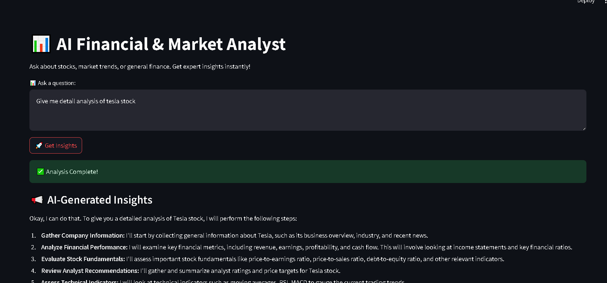

# AI Financial & Market Analyst



## Overview
AI Financial & Market Analyst is a Streamlit-based application designed to provide real-time financial insights, stock market analysis, and web research using AI-powered agents. It leverages Google's Gemini model, Yahoo Finance tools, and Google Search to deliver comprehensive market intelligence.

## Features
- **Stock Market Analysis**: Retrieve stock prices, company fundamentals, analyst recommendations, and technical indicators.
- **Financial Data Comparison**: Compare multiple stocks based on key financial metrics like P/E ratio, EPS growth, and debt-to-equity ratio.
- **Investment Recommendations**: Get AI-driven investment advice based on financial analysis and risk assessment.
- **Web Research**: Fetch the latest financial news and insights from trusted sources using Google Search.
- **User-Friendly Interface**: Streamlit-powered UI for easy interaction and real-time analysis.

## Installation
### Prerequisites
Ensure you have the following installed:
- Python 3.8+
- Pip
- Virtual environment (optional but recommended)

### Setup Instructions
1. Clone the repository:
   ```sh
   git clone https://github.com/PriyanshuDey23/Cal-Quity.git
   cd ai-financial-analyst
   ```
2. Create and activate a virtual environment (optional but recommended):
   ```sh
   python -m venv venv
   source venv/bin/activate  # On Windows use: venv\Scripts\activate
   ```
3. Install dependencies:
   ```sh
   pip install -r requirements.txt
   ```
4. Set up environment variables:
   - Create a `.env` file in the project directory.
   - Add the following line, replacing `your_api_key` with your actual Google API Key:
     ```sh
     GOOGLE_API_KEY=your_api_key
     ```

## Usage
Run the application with:
```sh
streamlit run main.py
```

### How It Works
1. Enter a financial or market-related question in the text area.
2. Click the **Get Insights** button.
3. The AI agents analyze the query and provide a detailed response, including tables and investment insights.
4. Results are displayed in the Streamlit interface with structured data and recommendations.

## Tech Stack
- **Python**: Primary programming language.
- **Streamlit**: UI framework for building interactive web applications.
- **Phi Agents & Google Gemini**: AI-driven financial analysis.
- **Yahoo Finance API**: Real-time stock market data.
- **Google Search API**: Web research capabilities.


## License
This project is licensed under the MIT License.


